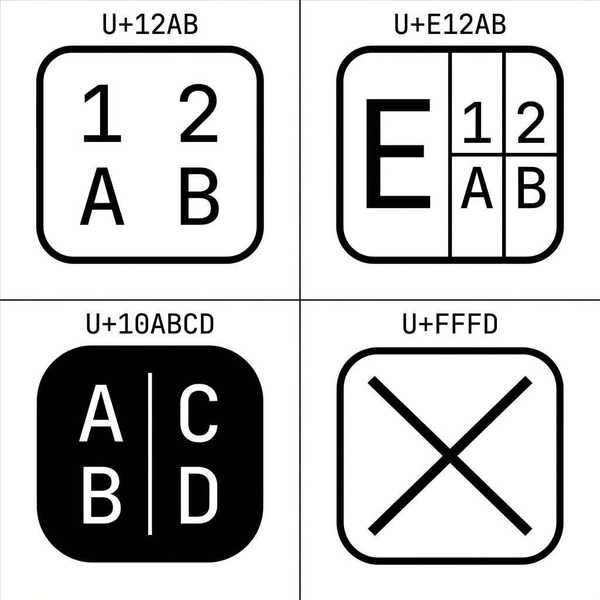
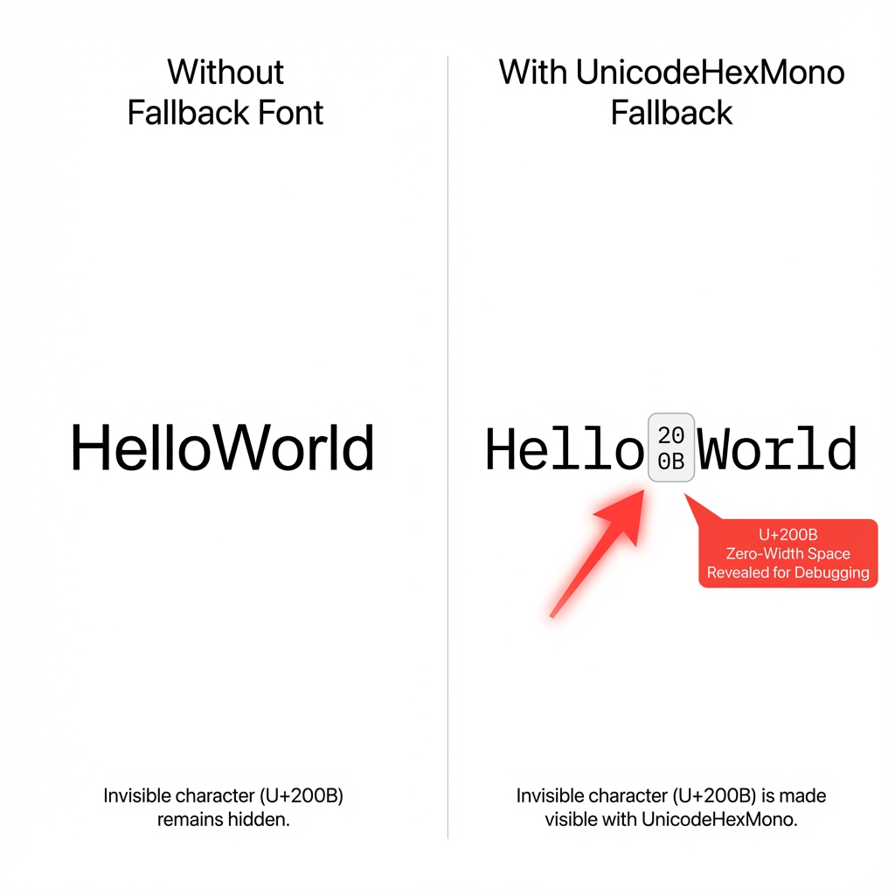

# UnicodeHexMono

> **A monospaced font covering all Unicode characters (U+0000 to U+10FFFD) with hexadecimal codepoint display**

[](https://www.npmjs.com/package/unicode-hex-mono)
[](https://www.npmjs.com/package/unicode-hex-mono)
[](LICENSE)
[](https://unicode.org/)
[](https://www.w3.org/TR/WOFF2/)

Perfect as a **debugging and fallback font** to visualize invisible characters, detect missing glyphs, and identify mystery Unicode symbols by their hexadecimal codepoints.

## 📸 Visual Examples

### Glyph Display Formats



*UnicodeHexMono renders different Unicode ranges with distinct visual styles for easy identification.*

### Debugging in Action



*Invisible characters become visible, making debugging text issues effortless.*

---

## ✨ Features

- 🌍 **Complete Unicode Coverage** - All 1,111,998 valid Unicode codepoints (U+0000 to U+10FFFD)
- 🔢 **Hex Display** - Each glyph shows its hexadecimal codepoint in a clean 2×2 grid
- 📦 **NPM Package** - Easy installation with `npm install unicode-hex-mono`
- ⚡ **Optimized Loading** - Browser loads only needed font files via CSS `unicode-range`
- 🗜️ **WOFF2 Compression** - 97.6% smaller than OTF (10 MB vs 414 MB)
- 🎯 **Monospaced** - Fixed-width design for consistent alignment
- 🔍 **Debugging Tool** - Identify invisible characters (zero-width spaces, RTL marks, control chars)
- 🌐 **i18n Helper** - Detect missing glyphs in your primary font
- 📝 **20 Font Files** - Split architecture: 1 optimized ASCII file + 19 ranges for full Unicode

---

## 🎯 Use Cases

**🐛 Debugging**
```
Your text contains: "Hello​World"
                            ↑ 
                      U+200B (zero-width space)
```

**🌐 Internationalization**
- Detect which characters your primary font is missing
- Test international text rendering
- Identify mixed-script issues

**💻 Development**
- Visualize invisible Unicode (BOM, zero-width joiners, directional marks)
- Debug text encoding issues
- Fallback for code editors and terminals

---

## 📦 Installation

### NPM (Recommended)

```bash
npm install unicode-hex-mono
# or
yarn add unicode-hex-mono
# or
pnpm add unicode-hex-mono
```

### Usage

The font is designed as a **fallback** in your CSS font stack:

#### Option 1: CSS Import (Recommended)

```css
/* Import the pre-generated CSS */
@import 'unicode-hex-mono/dist/font.css';

/* Use as fallback font */
body {
  font-family: 'Inter', 'UnicodeHexMono', monospace;
}
```

#### Option 2: HTML Link Tag

```html
<!DOCTYPE html>
<html>
<head>
  <link rel="stylesheet" href="node_modules/unicode-hex-mono/dist/font.css">
  <style>
    body {
      font-family: 'Your Primary Font', 'UnicodeHexMono', monospace;
    }
  </style>
</head>
</html>
```

#### Option 3: Modern Bundlers (Webpack, Vite, Parcel)

```javascript
// Import in your JavaScript entry point
import 'unicode-hex-mono/dist/font.css';
```

```css
/* Use in your CSS */
.debug-text {
  font-family: 'UnicodeHexMono', monospace;
}
```

---

## 🎨 Glyph Display Formats

UnicodeHexMono renders different Unicode ranges with distinct visual styles:

### ASCII & Extended ASCII (U+0000 - U+00FF)

**2 huge hex digits** horizontally centered inside outlined rounded square:

```
Example: U+0041 ('A') displays as:
┌─────────┐
│  4   1  │  ← Only 2 digits, 54% larger
└─────────┘
```

**Why different?** This range contains the most commonly used characters (standard ASCII and Latin-1). The larger, simpler 2-digit format makes them:
- **Easier to read** at smaller font sizes
- **Faster to identify** during debugging
- **Visually distinct** from other Unicode ranges

Examples:
- U+0041 ('A') → **41**
- U+007E ('~') → **7E**
- U+00FF (ÿ) → **FF**

### Other BMP Characters (U+0100 - U+FFFF)

4-digit hex code in **2×2 grid** inside outlined rounded square:

```
Example: U+12AB displays as:
┌─────────┐
│  1   2  │
│  A   B  │
└─────────┘
```

### Supplementary Planes 1-15 (U+10000 - U+FFFFF)

**Split layout** with large plane digit + 2×2 grid:

```
Example: U+E12AB displays as:
┌─────────────┐
│  E  │ 1  2 │
│     │ A  B │
└─────────────┘
 (large)  (grid)
```

### Plane 16 (U+100000 - U+10FFFD)

**Filled square** with vertical separator showing last 4 digits:

```
Example: U+10ABCD displays as:
┌─────────┐
│ A │ B  │ ← Filled background
│ C │ D  │   More rounded corners
└─────────┘
```

### Replacement Character (U+FFFD)

Diagonal **X** inside outlined square

---

## ⚠️ Known Limitations

### Whitespace and Control Characters

Due to browser text rendering behavior, some characters appear **blank** even though the font contains visible glyphs:

**Control Characters:**
- U+0000 (NULL)
- U+0009 (TAB)
- U+000A (Line Feed)
- U+000B-U+000D (VT, FF, CR)

**Whitespace:**
- U+0020 (SPACE)
- U+00AD (Soft Hyphen)
- U+2000-U+200F (Various spaces and format characters)

**Invisible Specials:**
- U+FFF0-U+FFF8 (Interlinear annotation characters)

**Why:** Browsers recognize these codepoints by their Unicode semantics and apply hardcoded rendering rules (spacing, line breaks, invisibility) that completely bypass the font's glyph outlines. This is expected browser behavior per Unicode specification.

**Workaround:** Use hex editors, Unicode inspectors, or character code viewers to examine these characters.

---

## ⚡ Performance

- **Smart Loading**: Browser automatically loads only needed font files
- **WOFF2 Priority**: 40× smaller files for faster loading (10 MB vs 414 MB)
- **CSS Optimization**: `unicode-range` selectors enable on-demand loading
- **Font Display Swap**: Text visible immediately with fallback fonts

**Package Size**: 24.6 MB compressed, 416.1 MB unpacked (38 files: 19 ranges × 2 formats)

---

## 🛠️ Generate Fonts from Source

### Prerequisites

- **FontForge** with Python scripting
  ```bash
  brew install fontforge  # macOS
  ```
- **Python 3.x** for test server
- **fonttools + brotli** for WOFF2 generation
  ```bash
  pip3 install --break-system-packages fonttools brotli
  ```

### Build

```bash
# Generate all 40 font files (20 ranges × 2 formats)
fontforge -script main.py

# Test in browser
python3 -m http.server 8080
# Then open http://localhost:8080/index.html
```

**Generation Time**: ~5-10 minutes for all 20 font files

### Troubleshooting

#### "fonttools not installed" warning

If you see `⚠ fonttools not installed - skipping WOFF2 generation` even after installing fonttools:

**Cause**: FontForge uses its own Python interpreter, which may be different from your system Python.

**Fix**:
```bash
# Check FontForge's Python version
fontforge -script -c "import sys; print(sys.version)"

# Install for that specific Python version (e.g., 3.14)
python3.14 -m pip install --break-system-packages fonttools brotli
```

See [CONTRIBUTING.md](CONTRIBUTING.md#troubleshooting) for more details.

---

## 📁 Package Contents

```
dist/
├── UnicodeHexMono_00000_000FF.otf      (256 glyphs - ASCII & Extended ASCII)
├── UnicodeHexMono_00000_000FF.woff2
├── UnicodeHexMono_00100_0F25F.otf      (~61,800 glyphs)
├── UnicodeHexMono_00100_0F25F.woff2
├── UnicodeHexMono_0F260_1DCE1.otf      (60,002 glyphs)
├── UnicodeHexMono_0F260_1DCE1.woff2
├── ... (17 more ranges)
└── font.css                             (Auto-generated @font-face rules)
```

- **40 font files**: 20 OTF + 20 WOFF2
- **1 CSS file**: All `@font-face` declarations with `unicode-range` optimization
- **Total Coverage**: 1,111,998 valid Unicode codepoints
- **Performance**: ASCII file (U+0000-U+00FF) is only ~20KB for fast loading of common characters

---

## 🏗️ Technical Details

### Architecture

**Modular Python Generator**:
- `main.py` - Entry point
- `generator.py` - Multi-file font generation engine
- `config.py` - Configuration constants
- `utils.py` - Drawing primitives (rounded squares, hex digits)
- `glyphs.py` - Glyph creation logic for different Unicode ranges
- `css_generator.py` - Automatic CSS generation

### Font Specifications

- **Format**: OpenType (OTF) + WOFF2
- **Encoding**: Unicode (BMP + supplementary planes)
- **EM Size**: 1000 units
- **Glyph Width**: 1000 units (monospaced)
- **Glyph Height**: 700 units
- **Corner Radius**: 70 units (BMP/Supplementary), 120 units (Plane 16)
- **Hex Digit Size**: 260 units (3×5 pixel grid rendering)

### Excluded Codepoints

- **Surrogate pairs** (U+D800-U+DFFF) - 2,048 codepoints
- **Non-characters** ending in FFFE/FFFF - 34 codepoints
- **Reserved non-characters** (U+FDD0-U+FDEF) - 32 codepoints

These exclusions prevent OTS parsing errors in browsers.

---

## 📖 Documentation

- **Full Development History**: See [HISTORY.md](HISTORY.md) for detailed changelog
- **NPM Package**: [unicode-hex-mono on npm](https://www.npmjs.com/package/unicode-hex-mono)
- **Unicode Standard**: [unicode.org](https://unicode.org/)

---

## 🤝 Contributing

Contributions are welcome! Please see [CONTRIBUTING.md](CONTRIBUTING.md) for guidelines.

Quick links:
- Report bugs via [GitHub Issues](https://github.com/Pratnomenis/unicode-hex-mono/issues)
- Submit feature requests
- Improve documentation
- Optimize font generation code

---

## 📄 License

MIT License - Copyright (c) 2025 Denis Ivanov

See [LICENSE](LICENSE) for full details.

---

## 🙏 Acknowledgments

- Built with [FontForge](https://fontforge.org/) - Open source font editor
- WOFF2 compression via [fonttools](https://github.com/fonttools/fonttools)
- Unicode character database from [Unicode Consortium](https://unicode.org/)

---

**Made with ❤️ for developers debugging invisible Unicode mysteries**
